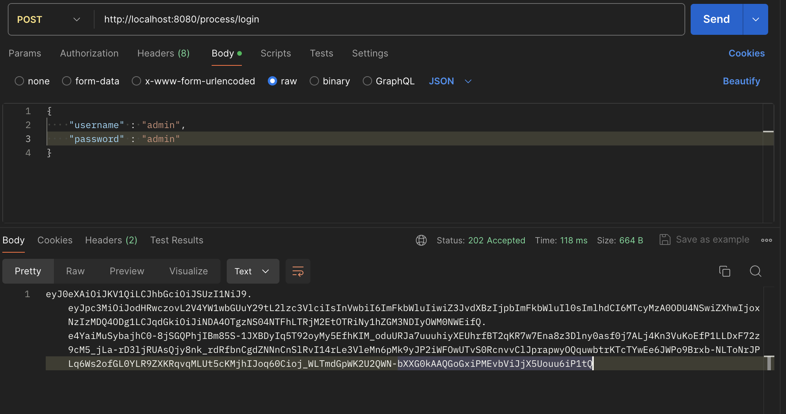
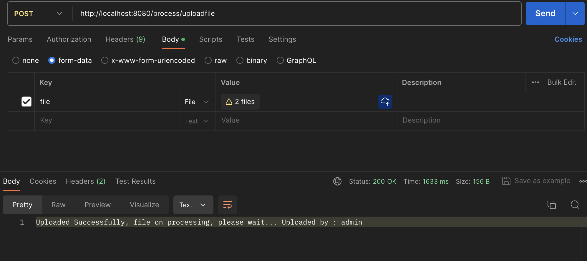
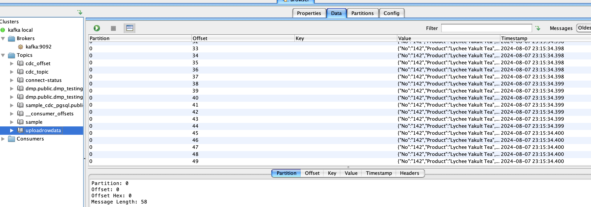
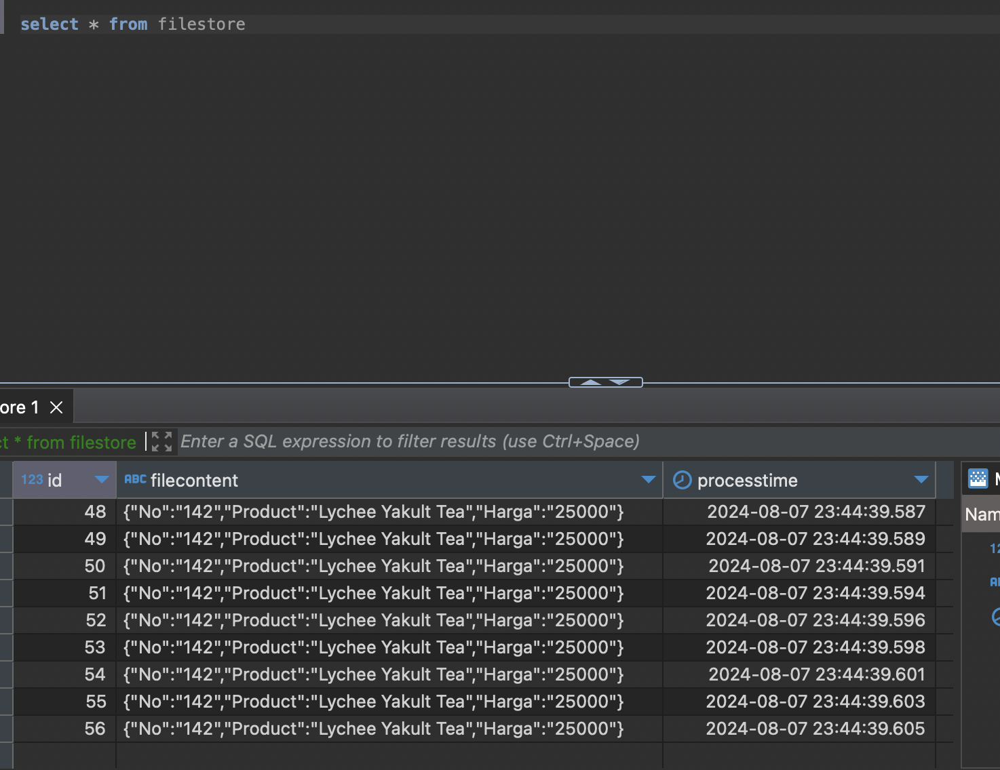

# Flow Process
## JWT Auth RBAC
endpoint login [http://localhost:8080/process/login] use to get token for RBAC admin in upload endpoint[ http://localhost:8080/process/uploadfile]

## Process bulk / batch upload
endpoint bulk upload [http://localhost:8080/process/bulkupload] use to upload multiple files

## Queue Processing with Kafka
When data uploaded, csv and xls will convert to json structure then send to kafka massage to process queue in background

## Final process data will store to table
End of process record will be store to table in pgsql

